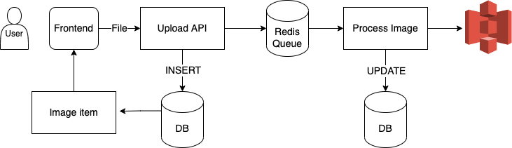

# blc-backend

## About the Project

### Description

Backend for a simple post-comment app

### Tech Stack

<ul>
  <li><a href="https://www.typescriptlang.org/">Typescript</a></li>
  <li><a href="https://nestjs.com/">Nest.js</a></li>
  <li><a href="https://www.postgresql.org/">PostgreSQL<a></li>
  <li><a href="https://redis.io/">Redis</a></li>
  <li><a href="https://aws.amazon.com/s3/">Amazon S3</a></li>
  <li><a href="https://www.serverless.com/>">Serverless</a></li>
</ul>

## Getting Started

### Prerequisites

Install Yarn

```bash
npm install --global yarn
```

### Installation

Clone the repo

```bash
git clone https://github.com/huylhd/blc-backend.git
```

Install dependencies

```bash
cd blc-backend && yarn
```

Create `.env` file for environment variables

```bash
cat .env.example > .env
```

To run this project, you will need to add the following environment variables to your .env file

```bash
DB_NAME="Postgres database name"
DB_USER="Postgres username"
DB_PASSWORD="Postgres user password"
DB_HOST="Postgres host"
DB_PORT="Postgres port"
API_KEY="Api key for serverless app"
BUCKET_NAME="S3 bucket"
REDIS_HOST="Redis host"
REDIS_PORT="Redis port"
REDIS_PASSWORD="Redis password"
```

### Run locally

```bash
yarn run start:dev
```

### Run locally using serverless-offline plugin

```bash
sls offline
```

### Deployment

```bash
sls deploy
```

### API

swagger-ui: http://127.0.0.1:3000/documentation.html


### Authentication

- Protected APIs: Requires `x-user` header (using `user.id` as value)
- When deployed, requires `x-api-key` header in all requests (value can be set in `.env`)

## Features

### Cursor pagination

Implement cursor pagination to get list of posts, order by number of comments descending

**Request**

```
GET /api/v1/posts?limit={limit}&cursor={cursor}
```

**Response**

```json
{
  "data": [...],
  "paging": {
    "nextCursor": "eyJjb21tZW50Q291bnQiOjEsInNlcUlkIjozLCJ0eXBlIjoiYmVmb3JlIn0=",
    "prevCursor": "eyJjb21tZW50Q291bnQiOjAsInNlcUlkIjoxLCJ0eXBlIjoiYmVmb3JlIn0"
  }
}
```

### Image processing queue

Implement a task queue with Bull Queue and Redis to upload image API

**Upload flow**


- File is uploaded through upload api
- Server insert a record into `images` table, return created data as response

`UPDATE: Because we are using Lambda, we will replace Redis with SQS, and the consumer will be a lambda function triggered by SQS.`

**Request**

```
POST /api/v1/images/upload
```

**Response**

```json
{
  "id": "0L97JK1B4RX6Z15",
  "originalName": "Kim-jisoo.jpg",
  "authorId": "3DHSWFEFPBOAWO9",
  "status": "started"
}
```

- A new task containing file data is added to Bull Queue
- Task consumer pick up the task and start processing
- Image is resized to `600x600` and uploaded to **Amazon S3** (along with the original image)
- Update the path and status for image in database

**Note**: The client needs to perform some types of polling to get the image path once updated

## Deployment

All configurations to deploy project is configured in `serverless.yml` file

<ul>
  <li><a href="https://www.serverless.com/>">Serverless</a></li>
  <li><a href="https://aws.amazon.com/lambda/>">Amazon Lambda</a></li>
  <li><a href="https://aws.amazon.com/rds/">Amazon RDS</a></li>
  <li><a href="https://aws.amazon.com/s3/">Amazon S3</a></li>
</ul>

### Issue

We're having issue getting the address and port of RDS instance in `serverless.yml`. Currently the syntax

```
!GetAtt RDSDatabase.Endpoint.Address
```

is always returning `[object Object]`

**Temporary solution**

Manually putting the host and port of RDS instance in `.env`
